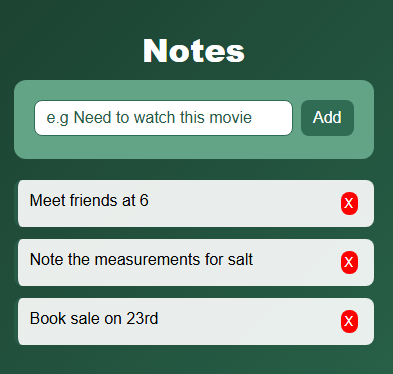

# Notes App 📝

A simple app to write, add, and delete notes.

## Live Demo
🔗 [notes-app-six-peach.vercel.app](https://notes-app-six-peach.vercel.app)

---

## Preview





---

## Features

- 📝 Add notes instantly
- ❌ Delete notes
- ⚡ Fast and lightweight

---

## Built With

<table>
  <tr>
    <td align="center" width="80">
      
      <br><sub>React</sub>
    </td>
    <td align="center" width="80">
      
      <br><sub>Vite</sub>
    </td>
    <td align="center" width="80">
      
      <br><sub>CSS3</sub>
    </td>
  </tr>
</table>

---

## Run Locally

```bash
git clone https://github.com/Aashutosh-kc/notes-app.git
cd notes-app
npm install
npm run dev
